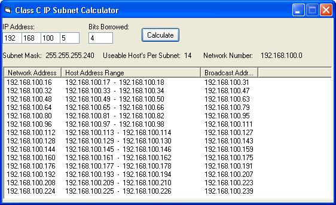



## IP Subnet Calculator

### Description

This is a Class C IP Subnet Calculator. I made it to help me remember how to subnet. I'm working on doing Class B and A addresses. I can't seem to remember if it's the first or the last ip that is the network number but I'll fix that once I figure it out. Comments are appreciated.
 
### More Info
 

             |
---                |---
**Submitted On**   |2002-02-13 18:49:32
**By**             |[Element\-X Software Productions](https://github.com/Planet-Source-Code/PSCIndex/blob/master/ByAuthor/element-x-software-productions.md)
**Level**          |Intermediate
**User Rating**    |5.0 (15 globes from 3 users)
**Compatibility**  |VB 6\.0
**Category**       |[Miscellaneous](https://github.com/Planet-Source-Code/PSCIndex/blob/master/ByCategory/miscellaneous__1-1.md)
**World**          |[Visual Basic](https://github.com/Planet-Source-Code/PSCIndex/blob/master/ByWorld/visual-basic.md)
**Archive File**   |[IP\_Subnet\_551502132002\.zip](https://github.com/Planet-Source-Code/element-x-software-productions-ip-subnet-calculator__1-31775/archive/master.zip)

